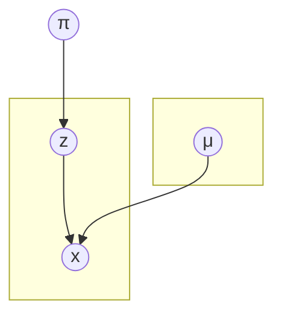

---
# try also 'default' to start simple
theme: default
title: 'On variational inference for gmm 1d fixed variance'
author: Rémi Emonet
---

# 

      

---

# Setup

(defining the model and assumptions)

$$
\gdef\lnp{\ln p}
\gdef\mcol{\blue}
\gdef\m{\mcol{μ}}
\gdef\pcol{\green}
\gdef\p{\pcol{π}}
\gdef\zcol{\red}
\gdef\z{\zcol{z}}
\gdef\Z{\zcol{Z}}
\gdef\s{σ}
\gdef\ndist#1#2{\mathcal{N}(#1,#2)}
\gdef\ndens#1#2#3{\mathcal{N}(#1,#2)(#3)}
\gdef\E{\mathbb{E}}
\gdef\comm#1{\text{\textcolor{gray}{#1} } }
$$

Gaussian mixture model
- K gaussians, each 1d,
- unknown weights,
- unknown means,
- fixed variances (we keep the variance in the derivations for flexibility)

We use $i=1..N$ as the observation index and $k=1..K$ as the component index.

We can write the decomposition of the (log) joint density

$$
\begin{align*}
 \lnp(X,\Z,\p,\m) & = \lnp(\p) + \sum_k \lnp(\m_k) + \sum_i \lnp(\z_i|\p) + \sum_i \lnp(x_i|\z_i,\m) \\
  & = \ln prior(\p) + \sum_k \ln prior(\m_k) + \sum_i \ln \p_{\z_i} + \sum_i \ln \ndens{\m_{\z_i}}{\s_{\z_i}^2}{x_i}
\end{align*}
$$

---

# Setting (conjugate) priors

<Logjoint/>

As priors, we use
- for $\p$, a Dirichlet distribution: $\p \sim Dir(α)$ (the hyper-parameter $α$ is a K-d vector of "virtual counts")
- for each $\m_k$, a Normal distribution: $\forall k, \m_k \sim \ndist{μ_0}{σ_0^2}$ ($μ_0$ and $σ_0$ are scalar hyperparameters)
- (we have supposed the prior is the same for all components)

"Reminders" on related (log) densities

$$
\begin{align*}
\ln \ndens{μ}{σ^2}{v} & = -½ \ln(2π) - \ln(σ) - \frac{(v-μ)^2}{2σ^2} &&= -\frac{1}{2 σ^2}v^2 + \frac{μ}{σ^2}v + K \\
\ln Dir(α)(π) & = - \ln B(α) + \sum_k (α_k-1) \ln(π_k) &&= \sum_k (α_k-1) \ln(π_k) + K\\
\end{align*}
$$

---

# Variational Inference principle

<Logjoint/>

We set variational distributions on the unknowns (here all $\z_i$, all $\m_k$ and $\p$).

We will find it through derivations but,
from the model, the nature of the variables and the conjugate priors,
we can already guess that (with $A, \{R_i\}_i, \{M_k, S_k\}_k$ the "variational parameters" that we will optimize)
- $\p$ follow a Dirichlet distribution: $\p \sim Dir(A)$ (where $A$ a K-d vector of virtual counts)
- $\forall i$: $\z_i$ follow a Caterogical distribution: $\z_i \sim Cat(R_i)$ (where $R_i$ is a K-d probability vector, *responsibilities*)
- $\forall k$: $\m_k$ follow a Normal Distribution: $\m_k \sim \ndist{M_k}{S_k}$ (where $M_k$ and $S_k$ are scalars)

By convention, the variational distribution $Dir(A)$ is denoted as $q_π$ \
... and similarly $\forall i, q_z^i = Cat(R_i)$ and $\forall k, q_μ^k = \ndist{M_k}{S_k}$.

Our goal is now to find a formula to optimize/update the (parameters of the) variational distributions $q_{...}$.

---

# Variational Inference: optimization

<Logjoint/>

A formula gives us the best value for a variational distribution, $\ln q_θ(\orange{θ}) = \E_{\negθ}[\lnp(X,\Z,\p,\m)] + K$
- this works for any parameter $θ$ (e.g. $π$ or $z_{42}$)
- the expectation $E_{\neg θ}$ is taken under the variational distributions, on all variables except $θ$
- e.g.,
  $$
  \E_{\neg π}[...] =
  \E_{\m_1 \sim q_μ^1} \E_{\m_2 \sim q_μ^2} \cdots \E_{\m_K \sim q_μ^K}
  \;\;
  \E_{\z_1 \sim q_z^1} \E_{\z_2 \sim q_z^2} \cdots \E_{\z_N \sim q_n^N}
  [...]
  $$

Luckily:
- we will look at a particular $\ln q_θ(\orange{θ})$ (each of them in turn),
- we will try to identify it to a known (log)density, some terms of $\lnp(X,\Z,\p,\m)$ will be in the constant,
- many of the expectation will also disappear or get limited to a very specific term.

Let's do it!!!

---
layout: anim
spec: '@maths 1-9'
---

<Logjoint class="absolute -top-3 right-0 opacity-60"/>

$$
\begin{align*}
\ln q_π(\p)
& = \E_{\neg π}[\lnp(X,\Z,\p,\m)] + K_1 \\
& \;\;\;\;\; \comm{(remove what is constant (and thus remains after expectation) with respect to $\p$)} \\
& = \E_{\neg π}\left[\ln prior(\p) + \sum_i \ln \p_{\z_i}\right] + K_2 \\
& \;\;\;\;\; \comm{(simplifying the expectations)} \\
& = \ln prior(\p) + \sum_i \E_{\z_i}[\ln \p_{\z_i}] + K_2 \\
& = \ln prior(\p) + \sum_i \sum_k q_z^i(k) \ln \p_k + K_2 \\
& \;\;\;\;\; \comm{($Dir(α)$ prior + swap sums)} \\
& = \sum_k (α_k -1 ) \ln \p_k + \sum_k \sum_i q_z^i(k) \ln \p_k + K_3 
\;\; \comm{with $q_z^i(k)$ the responsibility, i.e. $R_{ik}$} \\
& = \sum_k ((α_k+\sum_i R_{ik}) -1 ) \ln \p_k + K_3
\;\; \comm{(once reorganized)}
\end{align*}
$$

... so $q_π = Dir(A)$ with
$A = \left( (α_k + \sum_i R_{ik})\right)_k$
 (current smooth counts/responsibilities add up to prior virtual counts)

---
layout: anim
spec: '@maths 1-8'
---

<Logjoint class="absolute -top-3 right-0 opacity-60"/>

$$
\begin{align*}
\forall k,\;\; \ln q_μ^k(\m_k)
& = \E_{\neg μ_k}[\lnp(X,\Z,\p,\m)] + K_1 \\
& = \E_{\neg μ_k}\left[\ln prior(\m_k) + \sum_i \ln \ndens{\m_{\z_i}}{\s_{\z_i}^2}{x_i}\right] + K_2 \\
& = \ln prior(\m_k) + \sum_i \E_{z_i}[\ln \ndens{\m_{\z_i}}{\s_{\z_i}^2}{x_i}] + K_2 \\
& = - \frac{1}{2 σ_0^2} \m_k^2 + \frac{μ_0}{σ_0^2} \m_k + \sum_i\sum_{k'} q_z^i(k')\ln \ndens{\m_{k'}}{\s_{k'}^2}{x_i} + K_3 \\
& = - \frac{1}{2 σ_0^2} \m_k^2 + \frac{μ_0}{σ_0^2} \m_k + \sum_i q_z^i(k)\ln \ndens{\m_k}{\s_k^2}{x_i} + K_4 \\
& = - \frac{1}{2 σ_0^2} \m_k^2 + \frac{μ_0}{σ_0^2} \m_k + \sum_i R_{ik}\ln \ndens{x_i}{\s_k^2}{\m_k} + K_4 \;\;\comm{($x$ and $μ$ commute in a $\mathcal{N}$)} \\
& = - \frac{1}{2 σ_0^2} \m_k^2 + \frac{μ_0}{σ_0^2} \m_k + \sum_i R_{ik} \left(-\frac{1}{2\s_k^2}\m_k^2 + \frac{x_i}{\s_k^2}\m_k\right) + K_5 \\
& = - \frac{1}{2} \left(\frac{1}{σ_0^2} + \frac{\sum_i R_{ik}}{\s_k^2}\right) \m_k^2
    + \left(\frac{μ_0}{σ_0^2} + \frac{\sum_i R_{ik} x_i}{\s_k^2} \right) \m_k + K_5
    \;\;\comm{(we identify on the next slide)}\\
\end{align*}
$$

---

$$
\begin{align*}
\forall k,\;\; \ln q_μ^k(\m_k)
& = - \frac{1}{2} \left(\frac{1}{σ_0^2} + \frac{\sum_i R_{ik}}{\s_k^2}\right) \m_k^2
    + \left(\frac{μ_0}{σ_0^2} + \frac{\sum_i R_{ik} x_i}{\s_k^2} \right) \m_k + K_5 \\
\end{align*}
$$

... so $q_μ^k = \ndist{M_k}{S_k}$ with

- variance $S_k = \left(\frac{1}{σ_0^2} + \frac{\sum_i R_{ik}}{\s_k^2}\right)^{-1}$ \
  &nbsp;
- mean $M_k = \left(\frac{μ_0}{σ_0^2} + \frac{\sum_i R_{ik} x_i}{\s_k^2} \right) \times {S_k}$

NB
- $\sum_i R_{ik}$ is the mass currently affected to component $k$
- $\sum_i R_{ik} x_i$ is the weight mean of the points

---

<Logjoint class="absolute -top-3 right-0 opacity-60"/>

$$
\begin{align*}
\forall i,\;\; \ln q_z^i(\z_i)
& = \E_{\neg z_i}[\lnp(X,\Z,\p,\m)] + K_1 \\
& = \E_{\neg z_i}\left[ \ln \p_{\z_i} + \ln \ndens{\m_{\z_i}}{\s_{\z_i}^2}{x_i} \right] + K_2 \;\;\comm{(distribute, simplify and $x$-$μ$ swap)} \\
& = \E_{\p}[ \ln \p_{\z_i} ] + \E_{\m_{\z_i}}[ \ln \ndens{x_i}{\s_{\z_i}^2}{\m_{\z_i}} ] + K_2 \\
\E_{\m_{\z_i}}[ \ln \ndens{x_i}{\s_{\z_i}^2}{\m_{\z_i}} ]
& = \E_{\m_{\z_i}}\left[ -\frac{1}{2 \s_{\z_i}}\m_{\z_i}^2 + \frac{x_i}{\s_{\z_i}}\m_{\z_i} \right] + K_3 
& = -\frac{1}{2 \s_{\z_i}} \E_{\m_{\z_i}}\left[\m_{\z_i}^2\right] + \frac{x_i}{\s_{\z_i}}\E_{\m_{\z_i}}[\m_{\z_i} ] + K_3 \\
& = -\frac{1}{2 \s_{\z_i}} (S_{\z_i} + M_{\z_i}) + \frac{x_i}{\s_{\z_i}}M_{\z_i} + K_3 \\
\E_{\p}[ \ln \p_{\z_i} ]
& = \psi(A_{\z_i}) - \psi\left(\sum_k A_k\right) \;\; \comm{($\psi$ the digamma function, cf $Dir(A)$ on wikipedia)}  \\
\end{align*}
$$

$$
\begin{align*}
\text{so...}\; \forall i,\forall k,\;\; R'_{ik}
& = exp\left(\psi(A_{\z_i}) - \psi\left(\sum_k A_k\right) -\frac{1}{2 \s_{\z_i}} (S_{\z_i} + M_{\z_i}) + \frac{x_i}{\s_{\z_i}}M_{\z_i}\right) \\
R_{ik} &= R'_{ik} / \sum_{k'}{R'_{ik'}}
\end{align*}
$$

